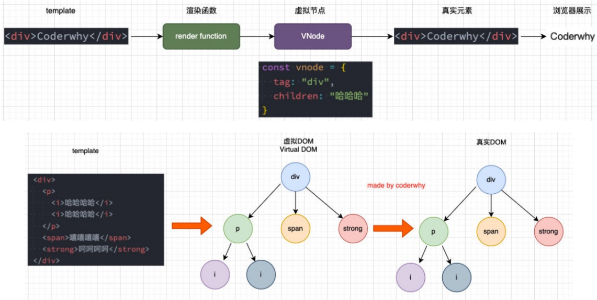
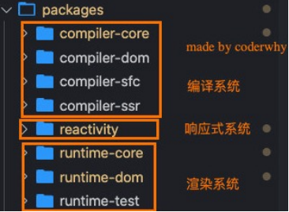

## Vue3源码学习

### 虚拟DOM

#### 虚拟DOM的优势

> 目前框架都会引入虚拟DOM来对真实的DOM进行抽象，这样做有很多的好处：

1. 因为对于直接操作DOM来说是有很多的限制的，比如diff、clone等等，但是使用JavaScript编程语言来操作这 些，就变得非常的简单；
2. 是方便实现跨平台，包括你可以将VNode节点渲染成任意你想要的节点

#### 虚拟DOM的渲染过程



### 三大核心系统

* Compiler模块：编译模板系统； 

* Reactivity模块：响应式系统

* Runtime模块：也可以称之为Renderer模块，真正渲染的模块； 

  



协同工作方式：

1. 对.vue进行Compiler模块解析，生成randerer函数，并转化成Vnode

2. 对Vnode进行diff算法对比，并绑定响应式
3. 由虚拟DOM生成真实DOM进行数据展示

### 实现Mini-Vue

这里我们实现一个简洁版的Mini-Vue框架，该Vue包括三个模块：

* 渲染系统模块； `runtime -> vnode -> 真实dom`

* 可响应式系统模块； `reactive(vue2/vue3)`

* 应用程序入口模块;   `createApp(rootComponent).mount('#app')`

#### 渲染系统实现

渲染系统，该模块主要包含三个功能： 

**功能一**：h函数，用于返回一个VNode对象； 

**功能二**：mount函数，用于将VNode挂载到DOM上； 

**功能三**：patch函数，用于对两个VNode进行对比，决定如何处理新的VNode；

```html
<div id="app"></div>
<script src="./render.js"></script>
<script>
  // 1. 通过h函数创建vnode
  const vnode = h('div', { class: 'cont',id:'aaa' }, [
    h('p', null, '当前计数：100'),
    h('button', {class:'add-btn'}, '+1'),
    h('button', null, '-1')
  ]);
  // 2. 通过mount函数，将vnode挂载到#app上
  mount(vnode, document.querySelector('#app'));

  // 3. patch函数
  const vnode1 = h('div', { class: 'new-vnode',id:'aaa' }, [
    h('p', null, '哈哈'),
  ]);
  setTimeout(() => {
    patch(vnode, vnode1);
  }, 1000);
</script>
```

```js
// render.js

// 功能一：h函数
const h = (tag, porps, children) => {
  return {
    tag,
    porps,
    children,
  };
};
// 功能二：mount函数
const mount = (vnode, container) => {
  // 创建标签DOM
  const el = (vnode.el = document.createElement(vnode.tag));
  // 给props设置属性/绑定事件
  if (vnode.porps) {
    for (let key in vnode.porps) {
      const value = vnode.porps[key];
      if (key.startsWith('on')) {
        el.addEventListener(key.slice(2).toLowerCase(), value);
      } else {
        el.setAttribute(key, value);
      }
    }
  }
  // 给child设置
  if (vnode.children) {
    if (typeof vnode.children === 'string') {
      el.textContent = vnode.children; //innerText 与样式有关, 会触发回流, textContent 不会
    } else {
      vnode.children.forEach((child) => {
        mount(child, el);
      });
    }
  }
  container.appendChild(el);
};
// 功能三：对两个VNode进行对比
const patch = (n1, n2) => {
  // 标签不同直接进行替换
  if (n1.tag !== n2.tag) {
    const parent = n1.el.parentElement;
    parent.removeChild(n1.el);
    mount(n2, parent);
  } else {
    const el = (n2.el = n1.el);
    const oldProps = n1.porps || {};
    const newProps = n2.porps || {};
    // 对新属性进行增加
    for (let key in newProps) {
      const oldValue = oldProps[key];
      const newValue = newProps[key];
      if (newValue !== oldValue) {
        if (key.startsWith('on')) {
          el.addEventListener(key.slice(2).toLowerCase(), newValue);
        } else {
          el.setAttribute(key, newValue);
        }
      }
    }
    // 对旧属性进行删除
    for (let key in oldProps) {
      // 在上面给newProps添加事件监听时，因为事件函数内存地址不同，所以即使相同函数也会判断不同，导致重复添加。
      // 所以这里删除oldProps所有事件
      if (key.startsWith('on')) {
        el.removeEventListener(key.slice(2).toLowerCase(), oldProps[key]);
      }
      if (!(key in newProps)) {
        el.removeAttribute(key);
      }
    }

    // 对child进行对比
    const oldChild = n1.children || [];
    const newChild = n2.children || [];

    if (typeof newChild === 'string') { // 情况一：newChild是一个string
      // 边界情况（edge case）
      if (typeof oldChild === 'string') {
        if (newChild !== oldChild) {
          el.textContent = newChild;
        }
      } else {
        el.innerHTML = newChild;
      }
    } else {  // 情况二：newChild是一个数组
      if (typeof oldChild === 'string') {
        el.innerHTML = '';
        newChild.forEach((item) => {
          mount(item, el);
        });
      } else {
        // old = [v1,v2,v3]
        // new = [v1,v5,v6]
        const minLength = Math.min(oldChild.length, newChild.length);
        //1. 只对前面相同的节点进行patch操作。注意是minLength，所以不会遍历多出来的vnode
        for (let i = 0; i < minLength; i++) {
          patch(oldChild[i], newChild[i]);
        }

        //2. old.length > new.length
        if (oldChild.length > newChild.length) {
          oldChild.slice(minLength).forEach((item) => {
            el.removeChild(item.el);
          });
        }

        //3. old.length < new.length
        if (oldChild.length < newChild.length) {
          newChild.slice(minLength).forEach((item) => {
            mount(item, el);
          });
        }
      }
    }
  }
};
```

#### 响应式系统实现

##### reactive的Vue2实现

```js
// reactive.js

class Dep {
  constructor() {
    this.subscribers = new Set();
  }
  depend() {
    if (watchData !== null) {
      this.subscribers.add(watchData);
    }
  }
  notify() {
    this.subscribers.forEach((effect) => effect());
  }
}

let watchData = null;
function watchEffect(effect) {
  watchData = effect;
  effect(); // 模拟watchEffect首次使用时会自动调用一次
  watchData = null; // 清空准备下次使用
}

//3.  为了每个属性都有依赖，使用如下数据结构
// WeakMap = {
//   obj1{}:new Map({
//     key1:dep1,
//     key2:dep2
//   }),
//   obj2{}:new Map({
//     key1:dep1,
//   })
// }
let targetMap = new WeakMap();
function getDep(raw, key) { // 把属性存放到targetMap中
  let target = targetMap.get(raw);
  if (!target) {
    target = new Map();
    targetMap.set(raw, target); // => {obj1{}:new Map()}
  }

  let dep = target.get(key);
  if (!dep) {
    dep = new Dep();
    target.set(key, dep); // =>  newMap({key1:dep1})
  }
  return dep;
}

function reactive(raw) {
  Object.keys(raw).forEach((key) => {
    // 2. 获取(或创建)当前对象属性的依赖
    let dep = getDep(raw, key);
    let value = raw[key];
    Object.defineProperty(raw, key, {
      get() {
        // 4. 第一次执行时，把当前key所在的函数，添加到当前key对应dep中，为发生通知做准备
        dep.depend();
        return value;
      },
      set(newValue) {
        if (value !== newValue) {
          value = newValue;
          //5. 属性发生改变时通知
          dep.notify();
        }
      },
    });
  });
  return raw
}

// 1. 对数据添加依赖
let info = reactive({
  counter: 10,
  name: 'vicer',
});
let foo = reactive({ bar: 'bar' });

watchEffect(() => {
  console.log('watch1:', info.counter * 2);
});
watchEffect(() => {
  console.log('watch2:', info.counter * info.counter);
});
watchEffect(() => {
  console.log('watch3:', info.name);
});
watchEffect(() => {
  console.log('watch4:', foo.bar);
});
// 改变属性发生通知
info.counter++;
// info.name = 'aaa'
// foo.bar = 'bbb'
```

##### reactive的Vue3实现

```js
// 与上述vue2实现相似，只有reactive函数不同，把defineProperty换成Proxy
function reactive(raw) {
  return new Proxy(raw, {	// Proxy会劫持整个对象，所以无需遍历
    get(target, key) {
      const dep = getDep(target, key);
      dep.depend();
      return target[key];
    },
    set(target, key, newValue) {
      const dep = getDep(target, key);
      target[key] = newValue;
      dep.notify();
    },
  });
}
```

##### 为什么Vue3选择Proxy？

**优点：**

* 新增对象时，Vue2需要再次调用definedProperty；而 Proxy 劫持的是整个对象，不需要做特殊处理；
* 修改对象时，defineProperty修改原来的 obj 对象就可以触发拦截；而使用 proxy，就必须修改代理对象，即 Proxy 的实例才可以触发拦截
* Proxy 的API比 defineProperty 更丰富，比如has，deleteProperty等
* Proxy 作为新标准将受到浏览器厂商重点持续的性能优化

**缺点：**

Proxy 不兼容IE，也没有 polyfill, defineProperty 能支持到IE9

#### 应用程序入口实现

```js
// createApp.js

function createApp(rootComponent) {
  return {
    mount(select) {	// vue中会返回一个mount方法，所以这里返回mount函数
      const container = document.querySelector(select);
      let isMount = false;
      let oldVnode = null;

      watchEffect(function () {
        if (!isMount) {
          oldVnode = rootComponent.render();	//render中使用了reactive数据，watchEffect函数使用时进行收集依赖
          mount(oldVnode, container);
          isMount = true
        } else {
          const newVnode = rootComponent.render();	// 数据改变时，需要重新获取，并进行patch
          patch(oldVnode, newVnode);
          oldVnode = newVnode;	// 重新赋值oldVnode，为下次patch做准备
        }
      });
    },
  };
}
```

#### 使用Mini-Vue

> 可以把渲染系统，响应式系统，应用入口中所有函数统一导出并在一个文件引用，当使用时直接引入即可

```html
<div id="app"></div>

<script src="./mini-vue/render.js"></script>
<script src="./mini-vue/reactive.js"></script>
<script src="./mini-vue/createApp.js"></script>
<script>
  const App = {
    data:reactive({
      counter:0
    }),
    render(){
      return h('div',null,[
        h('h2',null,`当前计数：${this.data.counter}`),
        h('button',{
          onClick:()=>{
            this.data.counter++;
          }
        },'+1')
      ])
    }
  }

  const app = createApp(App);
  app.mount('#app');
</script>
```

