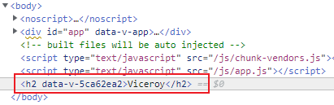

### 自定义指令

你需要`对DOM元素进行底层操作`，这个时候就会用到`自定义指令`

#### 基本示例

对input框自动获取焦点

##### 默认的实现方式

```vue
<template>
  <div>
    <input type="text" ref="inputEl">
  </div>
</template>

<script>
import {ref, onMounted} from 'vue';

export default {
  setup() {
    let inputEl = ref(null)	// 通过ref绑定对象
    onMounted(() => {
      inputEl.value.focus()	// 调用原生js进行聚焦
    })
    return {
      inputEl
    }
  }
}
</script>
```

##### 局部指令

```vue
<template>
  <div>
    <input type="text" v-focus>
  </div>
</template>

<script>
//注册一个局部组件指令 `v-focus`
directives:{
  focus:{
     // 指令的定义
    mounted:function(el){
      el.focus()
    }
  }
}
</script>
```

##### 全局指令

```js
const app = createApp(App);
// 注册一个全局自定义指令 `v-focus`
app.directive('focus', {
  // 当被绑定的元素插入到 DOM 中时……
  mounted: function (el) {
    // 聚焦元素
    el.focus()
  }
})
```

#### 指令的生命周期

> vue3的生命周期由原来的bind/inserted改为如下方式，更好进行语意化使用

`created`：在绑定元素的 attribute 或事件监听器被应用之前调用； 

`beforeMount`：当指令第一次绑定到元素并且在挂载父组件之前调用； 

`mounted`：在绑定元素的父组件被挂载后调用； 

`beforeUpdate`：在更新包含组件的 VNode 之前调用；

`updated`：在包含组件的 VNode 及其子组件的 VNode 更新后调用； 

`beforeUnmount`：在卸载绑定元素的父组件之前调用；

`unmounted`：当指令与元素解除绑定且父组件已卸载时，只调用一次


#### 指令的参数和修饰符

> 除了 `el` 之外，其它参数都应该是只读的

指令钩子函数会被传入以下参数：

- `el`：指令所绑定的元素，可以用来直接操作 DOM 。
- `binding`：一个对象，包含以下属性：

  - `name`：指令名，不包括 v- 前缀。

  - `value`：指令的绑定值，例如：v-my-directive="1 + 1" 中，绑定值为 2。

  - `oldValue`：指令绑定的前一个值，仅在 beforeUpdate和 updated钩子中可用。无论值是否改变都可用。  

  - `expression`：字符串形式的指令表达式。例如 v-my-directive="1 + 1" 中，表达式为 "1 + 1"。

  - `arg`：传给指令的参数，可选。例如 v-my-directive:foo 中，参数为 "foo"。

  - `modifiers`：一个包含修饰符的对象。例如：v-my-directive.foo.bar 中，修饰符对象为 { foo: true, bar: true }。
- `vnode`：Vue 编译生成的虚拟节点。可以拿到当前指令所在的上下文 context，也就是`可以拿到当前实例和方法`
- `oldVnode`：上一个虚拟节点，仅在 update 和 componentUpdated 钩子中可用。

```vue
<div id="app"></div>
<template id="directive">
	<div v-demo:foo.a.b="message"></div>
</template>

<script>
const app = Vue.createApp({
  template:`#directive`,
  data(){
    return{
      message:'hello world'
    }
  }
}).mount('#app');

// 注册一个全局自定义指令 `v-focus`
app.directive('demo', {
  mounted: function(el, binding, vnode){
    console.log('bind...');
    var s = JSON.stringify
    // 注意：binding参数中，常用的参数为 (绑定值：value)，(参数：arg)，(修饰符modifiers)
    el.innerHTML =
    'name: '       + s(binding.name) + '<br>' +					//name:'demo'
    'value: '      + s(binding.value) + '<br>' +				//value:'hello world'
    'expression: ' + s(binding.expression) + '<br>' +		//表达式 expression:'message'
    'argument: '   + s(binding.arg) + '<br>' +					//参数 argument:'foo'
    'modifiers: '  + s(binding.modifiers) + '<br>' +		//修饰符 modifiers:' { a: true, b: true }'
    'vnode keys: ' + Object.keys(vnode).join(', ')		  //vnode keys:'tag,data,children,text,elm等'
    }
})
</script>
```


#### 指令的使用示例

* 指令的参数动态使用

  ```vue
  //注意，这里left和right用中括号包裹，通过data进行赋值
  <div id="app"></div>
  <template id="directive">
    <div>
      <h3>在此部分内向下滚动 ↓</h3>
      <p v-pin:[left]="100">我固定在页面左侧100px处。</p>
      <p v-pin:[right]="100">我固定在页面右侧100px处。</p>
    </div>
  </template>
  
  
  <script>
  app.directive('pin', {
    bind: function (el, binding, vnode) {
      el.style.position = 'fixed'		//设置定位
      var s = (binding.arg == 'left' ? 'left' : binding.arg)	//判断参数left or right
      el.style[s] = binding.value + 'px'	//赋值value。
      //这里el.style[s]用中括号不是点，是因为s是动态变量，不是固定参数
    }
  })
  
  const app = Vue.createApp({
    template:`#directive`,
    data(){
      return{
        right: 'right',
        left: 'left'
      }
    }
  }).mount('#app');
  </script>
  ```

* 自定义指令时间戳

  ```vue
  // App.vue
  <template>
    <div>
      <span v-format-time="'YYYY/MM/DD'">1629027749</span>
    </div>
  </template>
  ```

  ```js
  // 使用dayjs格式化时间戳插件
  // 安装:  npm i dayjs -D
  import dayjs from "dayjs";
  
  export default function (app) {
    app.directive('format-time', {
      mounted(el,binding) {
        let time = el.textContent;
        let formatStr = binding.value;
        formatStr || (formatStr = 'YYYY-MM-DD HH:mm:ss'); // formatStr为false，则进行赋值
        time.length === 10 && (time = time * 1000); // 时间戳===10则*1000
        typeof time === 'string' && Number(time) // 等于string则转number
  
        el.textContent = dayjs(time).format(formatStr)
      }
    })
  }
  ```

  

### 内置组件：Teleport

> 当我们想要在div#app之外的元素进行封装组件（比如弹窗Toast），防止对#app内容进行干扰时，便可使用teleport

teleport翻译过来是心灵传输、远距离运输的意思

**teleport用法：**

* `to`：指定将其中的内容移动到的目标元素，可以使用选择器
* `disabled`：是否禁用 teleport 的功能

```vue
<template>
  <div>
    <teleport to="body">
      <h2>Viceroy</h2>
    </teleport>
    <!-- 如果有多个teleport并且目标相同（To的值相同），则会合并插入到目标元素中 -->
  </div>
</template>
```



### 认识Vue插件

> 通常我们向Vue全局添加一些功能时，会采用插件的模式，

插件可以完成的功能没有限制，比如下面的几种都是可以的： 

* 添加全局方法或者 property，通过把它们添加到 `config.globalProperties` 上实现；

* 添加全局资源：`指令/过滤器/过渡`等； 

* 通过`全局 mixin` 来添加一些组件选项； 

* `一个库，提供自己的 API`，同时提供上面提到的一个或多个功能；

#### 两种编写方式

* **对象类型：**一个对象，但是必须包含一个 install 的函数，该函数会在安装插件时执行； 

  ```js
  export default {
    install(app) {
      app.config.globalProperties.$name = 'viceroy'; // 全局变量为了防止重复命名，一般都会在前面加上$或者_
    }
  }
  ```

* **函数类型：**一个function，这个函数会在安装插件时自动执行

  ```js
  export default function (app){
    // app.components();
    // app.directive();
  }
  ```

#### 使用插件

在main.js中导入并使用

```js
// main.js
import pluginObject from './plugins/plugin_object';

const app = createApp(App)
app.use(pluginObject) // 当调用use方法时，app会自动调用对象中的install方法，并且传入app对象
```

#### 获取插件中定义的全局变量

```vue
<script>
import { getCurrentInstance } from 'vue';
export default {
  mounted() {
    console.log(this.$name)	// optionsAPI中可以通过this直接拿到
  },
  setup() { 	// setup中则要通过getCurrentInstance中获取
    const instance = getCurrentInstance()
    console.log(instance.appContext.config.globalProperties.$name)
  }
}
</script>
```


### SFC新特性：style标签的v-bind

SFC：单文件组件（即.vue 文件）

> 除了<script setup>Composition API编译语法糖，
>
> 还新增了<style> v-bind，用于在 SFC `<style>` 标签中，组件数据动态驱动CSS 值。并且该指令适用于<script setup>语法糖

```vue
<template>
  <h1>Hello Vue3.2</h1>
  <h2>{{ color }}</h2>
  <button @click="color = 'red'">color red</button>
  <button @click="fontSize = '40px'">fontSize 40px</button>
</template>

<script setup>
import { ref } from "vue";
const color = ref("pink");
const fontSize = ref("18px");
</script>

<style scoped>
h1 {
  color: v-bind(color);	 /* 通过v-bind动态绑定样式 */
  /* 其原理就是自定义属性将通过内联样式应用于组件的根元素，并在数值更改时进行响应更新。 */
}
h2 {
  font-size: v-bind(fontSize);
}
</style>
```


### v-memo

> 主要用来处理大型 `v-for` 列表，获取最大性能。

介绍：可实现对部分模板树的记忆功能。当`v-memo` 命中时，不仅允许 Vue 跳过虚拟 DOM 差异、甚至可以完全跳过新 VNode 的创建步骤

```html
<div v-for="user of users" :key="user.id" v-memo="[user.name]">
  {{ user.name }}
</div>
```

这个例子使用`v-memo`，不会重新创建虚拟元素，并且会重新使用前一个元素，除非`v-memo`的条件发生变化。这可能看起来是一个很小的改进，但如果您渲染大量元素，它实际上是性能的巨大改进。


`v-memo`还可以接受一组条件，例如：

```html
<div v-for="user of users" :key="user.id" v-memo="[user.name, selectedUserId === user.id]">
  <p :class="{ red: selectedUserId === user.id }">{{ user.name }}</p>
</div>
```

