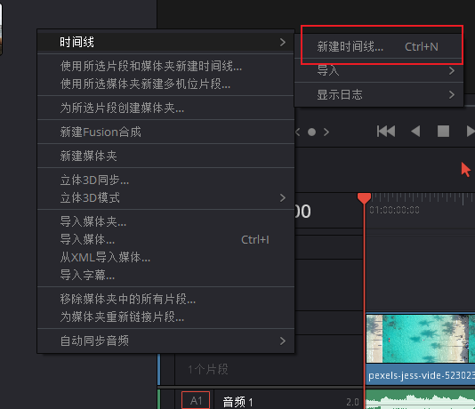
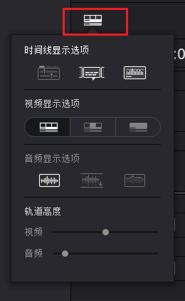
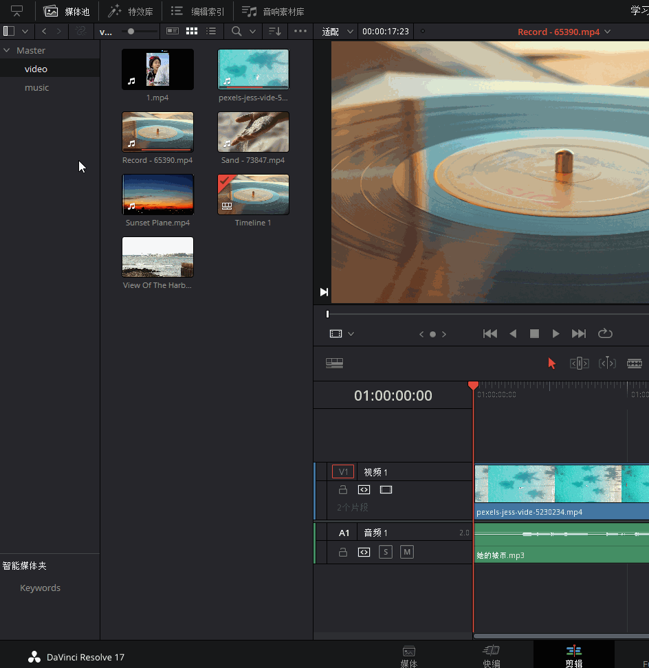
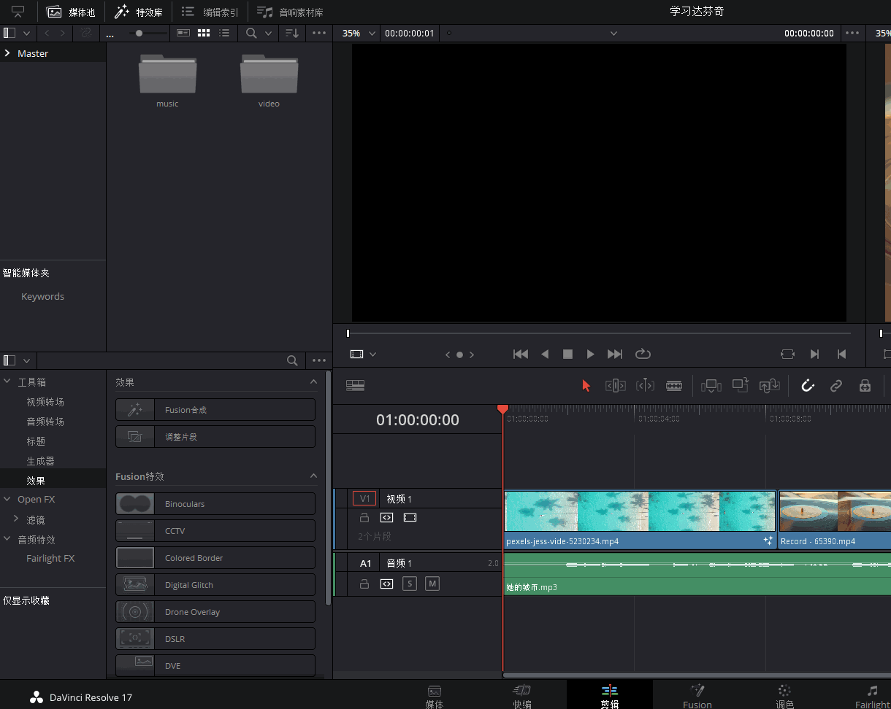

### 一、入门简介

1. 达芬奇支持的视频格式：ARI, MTS, MXF, AVI, CIN, DNG, DPX, CDX, MP4, MXF, EXR, MOV

2. 达芬奇不支持SWF, WMV, MPEG, VOB, FLV, MKV, WEBM, 3GP, RMVB, TS, M2TS, M4V, ASF等视频格式

### 二、剪辑面板

> 因为创建项目后不能再更改项目的帧率，所以创建项目第一点，先改变项目帧率

#### 改变帧率

点击`文件>项目设置>`，然后选择**主设置**，更改帧率为`25帧/秒`

国内一般使用PAL规格：

因为国内的交流电是50赫兹，而`25帧，50分之一的快门`来拍摄视频，可以更好的规避灯光的频闪

**注意：达芬奇16将素材导入媒体池时会出现"是否匹配素材与项目的帧速率"，确认后可自动匹配！**

#### 更改缓存位置

点击`文件>项目设置>`，然后选择**主设置**，在工作文件夹中更改缓存设置，不然你的C盘会很快被达芬奇挤满

#### 导入素材

首先对素材分类：

* 用先新键**媒体夹**来进行分类，然后导入素材，

* 也可以提前对视频进行分类，然后导入**媒体池**

然后`在媒体池中双击视频`，使用`i键`和`o键`，来对视频进行打下**入点**和**出点**，然后`拖动视频到时间线`

也可以`单独拖入视频或者音频`到时间线

#### 时间线

##### 创建时间线

可以通过`拖入素材的方式创建`时间线，但是这种创建方式太过混乱。可以在素材区右键，创建

##### 时间线显示波形

> 当需要调整时间线显示的样式时，可以在当前按钮中选择切换

##### 时间线缩放

可以按住`Alt`+`鼠标滚轮`来进行缩放。也可以按`Ctrl`+`+`或者`-`来调节时间线

#### 剪辑工具栏

> 当我们鼠标移入时，可以看到各个工具的模式名称及快捷键

##### 剪辑模式选择

* 选择模式 -（A）：主动选择时间线进行编辑，删除，挪动等

* 修剪编辑模式 -（T）：在时间线区间内，移动视频以选择起始点和结束点

  

* 动态修剪模式 -（W）：该模式是`修剪编辑模式`的补充用法，即抛弃鼠标，配合键盘J、K、L三键使用。

  * 【滑移】：相当于`在修剪编辑模式下`用`鼠标拖拽片段缩略图`，调整该片段区域内的首、尾帧，片段所在时间线位置不变。

    只不过在动态修剪模式下，是按J/K/L键调整首、尾帧，按住K键再按J/L，更精准。

  * 【滑动】：即相当于`在修剪编辑模式下`的`用鼠标拖拽片段名称部分`，调整该片段在时间线上的位置。

    在动态修剪模式下，是按J/K/L调整前一片段的尾帧和后一片段的首帧。实际上，动态修剪模式比修剪模式更准确并更有效率。

* 刀片编辑模式 -（B）：故名思意，对素材进行切割

##### 素材的插入方式

* 插入片段 -（F9）：故名思意，直接在`播放指针位置`插入新的片段
* 覆盖片段 -（F10）：在`播放指针位置`覆盖新的视频，并采用新片段的长度
* 替换片段 -（F11）：在`播放指针位置`替换新的视频，并复用上个片段的长度

##### 功能按钮

* 吸附 -（N）：打开后添加的素材会自动吸附
* 链接所选：在时间线中，视频和音频是分开的，如果你想要两个在一起剪辑，那么就可以把它们选中，点击`链接片段`

* 位置锁定：故名思意，一般做效果的时候可能会用，但实际中使用很少

##### 标注按钮

* 旗标 -（G）：更多用来对素材分类，在素材箱中也可以看到对应旗标，让我们对该素材一目了然，
* 标记 -（M）：用来对当前时间线进行标记，并且双击标记进行备注，对待办事项和多人合作是一个很大的帮助

### 三、添加效果与关键帧

#### 添加视频效果

点击`特效库`，选择对应的效果，拖动到对应时间线上即可

#### 添加视频转场

把转场效果拖动到`两个视频缝隙之间`即可。如果想要调整转场时间，鼠标移入转场效果，拖动缩放

